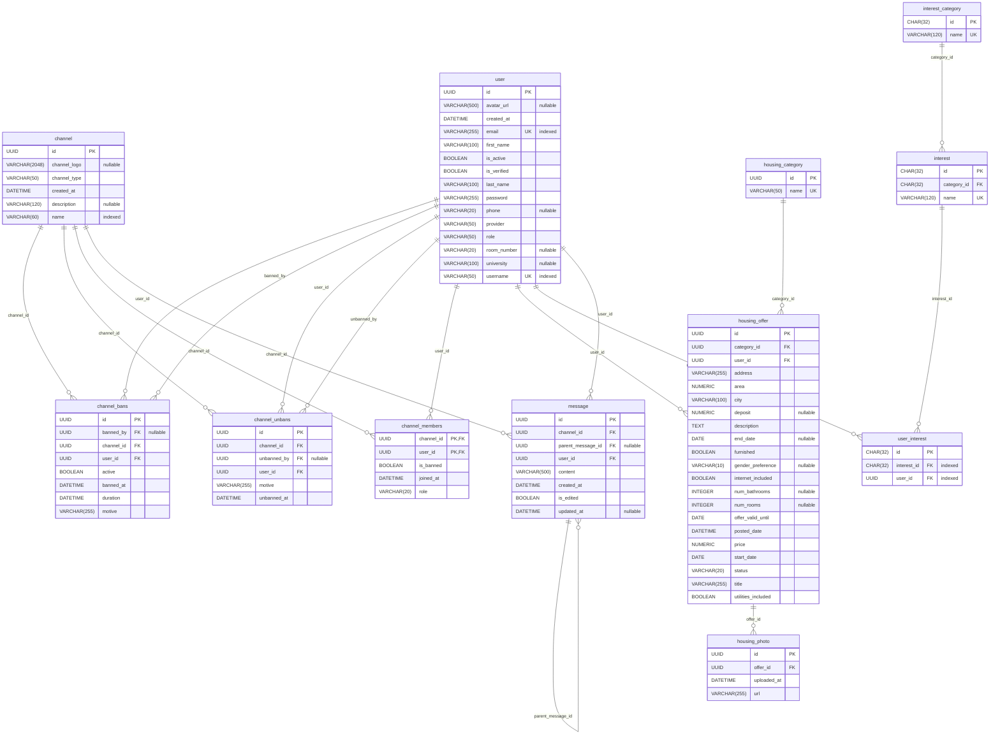

# UniHub - Backend

[](https://www.python.org/)
[](https://fastapi.tiangolo.com/)
[](https://www.sqlalchemy.org/)
[](https://github.com/astral-sh/uv)
[](https://pytest.org/)
[](https://www.docker.com/)

## Introduction

This project is part of the first semester project course at
the [University of Lleida (UdL)](https://www.udl.cat/ca/en/). It serves as the backend
for the UniHub application. This API includes the following main features:

- Configurable user profiles, matching their preferences with listings and communities
- Housing search (rooms/apartments) with filters
- Real-time chat (1:1 and groups)
- University communication channel
- Landlord–tenant/roommate group spaces
- Ratings & reviews (listings, landlords, tenants)
- Interest-based community channels
- [UniServices] Service listings (e.g., private tutoring)
- [UniItems] Second-hand marketplace (buy/sell items)
- [UniCommunities] Sponsored promotions in community chats (venues/events)
- [UniCar] Student carpooling with in-app payments and commissions

## Tech Stack

- **Framework**: FastAPI
- **Database**: PostgreSQL with SQLAlchemy
- **Package Manager**: uv
- **Testing**: pytest
- **Code Quality**: Ruff
- **CI/CD**: GitHub Actions

## Getting Started

### 1. Install uv

**macOS/Linux:**

```bash
curl -LsSf https://astral.sh/uv/install.sh | sh
```

**Windows (PowerShell):**

```powershell
powershell -ExecutionPolicy ByPass -c "irm https://astral.sh/uv/install.ps1 | iex"
```

**Alternative (using pip):**

```bash
pip install uv
```

> [!NOTE]
> After installation, restart your terminal or run `source ~/.bashrc` (Linux/macOS) or restart PowerShell (Windows).

### 2. Clone and Install

```bash
git clone https://github.com/Computer-Engineering-UdL/UniHub-Back
cd UniHub-Back
uv sync --group dev
```

### 3. Configure Environment

Create a `.env` file:

```env
API_VERSION=/api/v1
POSTGRES_HOST=localhost
POSTGRES_PORT=5432
POSTGRES_USER=unihub
POSTGRES_PASSWORD="test"
POSTGRES_DB=unihub
```

### 4. Run the Server

```bash
uv run uvicorn app.main:app --reload --host 0.0.0.0 --port 8080
```

Visit:

- API: `http://localhost:8080`
- Docs: `http://localhost:8080/docs`

## Development

### Run Tests

```bash
uv run pytest
```

### Check Code Quality

```bash
# Format code
uv run ruff format .

# Check for issues
uv run ruff check .
```

### Add Dependencies

```bash
# Production dependency
uv add package-name

# Development dependency
uv add --dev package-name
```

## Docker

```bash
# Build image
docker build -t unihub-backend .

# Run container
docker run -p 8080:8080 unihub-backend
```

## Project Structure

```
app/
├── api/v1/endpoints/    # API routes
├── core/                # Configuration
├── crud/                # Database operations
├── models/              # Data models
├── services/            # Business logic
└── main.py              # Entry point
tests/                   # Tests
```

## DB Schema



## Authors

<table>
  <tr>
    <td align="center">
      <a href="https://github.com/Aniol0012">
        <br/>
        
      </a>
    </td>
    <td align="center">
      <a href="https://github.com/carless7">
        <br/>
        
      </a>
    </td>
    <td align="center">
      <a href="https://github.com/cesarcres">
        <br/>
        
      </a>
    </td>
    <td align="center">
      <a href="https://github.com/JerzyLeg">
        <br/>
        
      </a>
    </td>
    <td align="center">
      <a href="https://github.com/TheSmuks">
        <br/>
        
      </a>
    </td>
  </tr>
</table>
